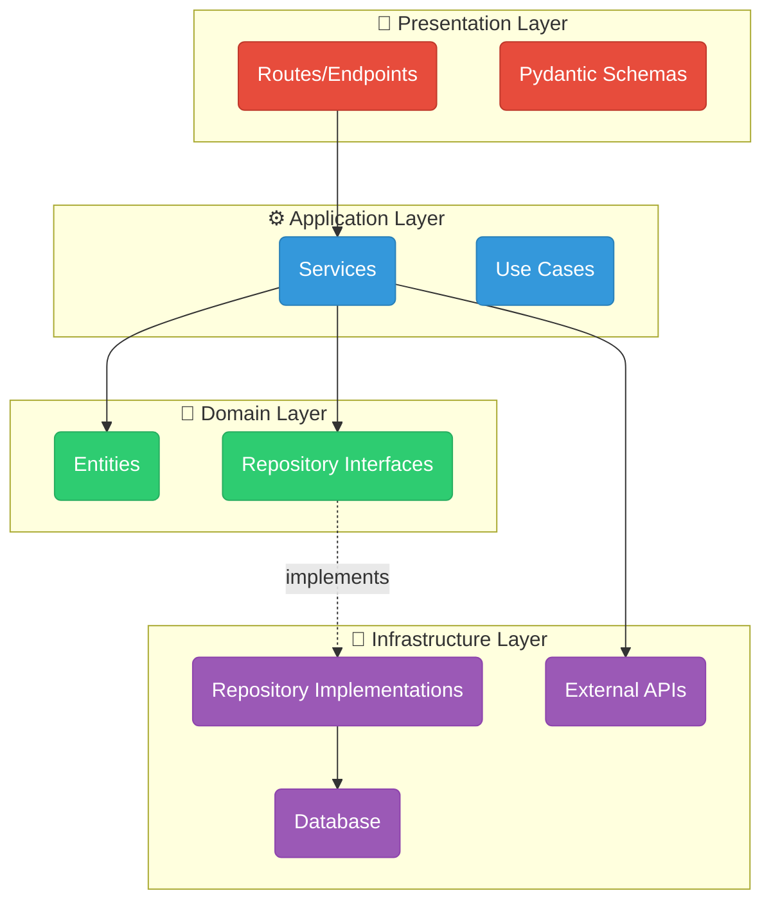

# Backend Architecture

Backend được thiết kế theo **Clean Architecture** với 4 layers tách biệt rõ ràng.

---

## Clean Architecture Layers



---

## Cấu Trúc Thư Mục

```plaintext
backend/app/
├── __init__.py
├── main.py                 # FastAPI entrypoint
├── scheduler.py            # APScheduler jobs
│
├── domain/                 # 💎 Domain Layer
│   ├── entities/           # SQLAlchemy Models
│   │   ├── user.py
│   │   ├── farm.py
│   │   ├── parcel.py
│   │   └── satellite_data.py
│   └── repositories/       # Abstract Repository Interfaces
│       └── base_repository.py
│
├── application/            # ⚙️ Application Layer
│   ├── services/           # Business Logic
│   │   ├── auth_service.py
│   │   ├── farm_service.py
│   │   ├── weather_service.py
│   │   └── satellite_service.py
│   └── schemas/            # Pydantic Models
│       ├── user_schema.py
│       ├── farm_schema.py
│       └── satellite_schema.py
│
├── infrastructure/         # 🔧 Infrastructure Layer
│   ├── database/           # Database connections
│   │   ├── connection.py
│   │   └── base.py
│   ├── repositories/       # Concrete implementations
│   │   ├── user_repository.py
│   │   └── farm_repository.py
│   └── external/           # External API clients
│       ├── copernicus_client.py
│       ├── weather_client.py
│       └── orion_ld_client.py
│
└── presentation/           # 🎨 Presentation Layer
    └── routes/             # FastAPI routers
        ├── auth_router.py
        ├── farm_router.py
        ├── weather_router.py
        └── satellite_router.py
```

---

## Dependency Injection

FastAPI sử dụng `Depends()` để inject dependencies:

```python title="presentation/routes/farm_router.py"
from fastapi import APIRouter, Depends
from app.application.services.farm_service import FarmService
from app.infrastructure.database.connection import get_db

router = APIRouter()

@router.get("/farms")
async def get_farms(
    db: AsyncSession = Depends(get_db),
    current_user: User = Depends(get_current_user)
):
    farm_service = FarmService(db)
    return await farm_service.get_all_farms(current_user.id)
```

---

## Database Models

### User Entity

```python title="domain/entities/user.py"
class User(Base):
    __tablename__ = "users"

    id = Column(Integer, primary_key=True)
    email = Column(String(255), unique=True, nullable=False)
    hashed_password = Column(String(255), nullable=False)
    full_name = Column(String(255))
    role = Column(String(50), default="farmer")

    # Relationships
    farms = relationship("Farm", back_populates="owner")
```

### Farm Entity

```python title="domain/entities/farm.py"
class Farm(Base):
    __tablename__ = "farms"

    id = Column(Integer, primary_key=True)
    name = Column(String(255), nullable=False)
    location = Column(String(255))
    area = Column(Float)

    # GeoJSON boundary
    geometry = Column(JSON)

    # Relationships
    owner_id = Column(Integer, ForeignKey("users.id"))
    parcels = relationship("Parcel", back_populates="farm")
    satellite_data = relationship(
        "SatelliteData",
        back_populates="farm",
        cascade="all, delete-orphan"  # CASCADE DELETE
    )
```

---

## Background Jobs

Sử dụng **APScheduler** cho các tác vụ định kỳ:

```python title="scheduler.py"
from apscheduler.schedulers.asyncio import AsyncIOScheduler

scheduler = AsyncIOScheduler()

# Đồng bộ ảnh vệ tinh mỗi 6 giờ
@scheduler.scheduled_job('interval', hours=6)
async def sync_satellite_images():
    await satellite_service.sync_all_farms()

# Cập nhật NDVI hàng ngày
@scheduler.scheduled_job('cron', hour=2, minute=0)
async def calculate_daily_ndvi():
    await satellite_service.calculate_ndvi_all()
```

---

## External API Integration

### Copernicus Data Space

```python
class CopernicusClient:
    BASE_URL = "https://catalogue.dataspace.copernicus.eu"

    async def search_products(
        self,
        bbox: List[float],
        start_date: datetime,
        end_date: datetime,
        collection: str = "SENTINEL-2"
    ) -> List[Product]:
        ...
```

### Orion-LD Context Broker

```python
class OrionLDClient:
    def __init__(self, url: str = "http://orion-ld:1026"):
        self.url = url

    async def create_entity(self, entity: dict) -> bool:
        headers = {"Content-Type": "application/ld+json"}
        async with httpx.AsyncClient() as client:
            response = await client.post(
                f"{self.url}/ngsi-ld/v1/entities",
                json=entity,
                headers=headers
            )
            return response.status_code == 201
```

---

## Bước Tiếp Theo

- [FIWARE Integration](fiware.md)
- [API Documentation](../api/authentication.md)
