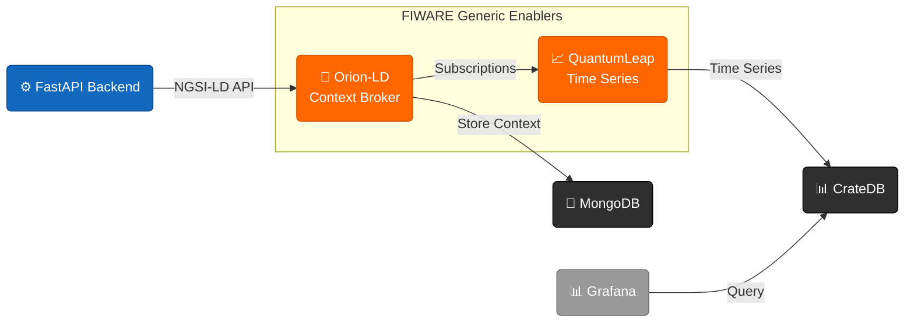

# FIWARE Integration

ICTU-OpenAgri tích hợp FIWARE stack để chuẩn hóa dữ liệu IoT theo NGSI-LD.

---

## Kiến Trúc FIWARE



---

## FIWARE Components

### Orion-LD Context Broker

- **Chức năng**: Quản lý ngữ cảnh (context) theo chuẩn NGSI-LD
- **Port**: `1026`
- **Database**: MongoDB

```bash
# Kiểm tra trạng thái
curl http://localhost:1026/version

# Lấy danh sách entities
curl http://localhost:1026/ngsi-ld/v1/entities \
  -H "Accept: application/ld+json"
```

### QuantumLeap

- **Chức năng**: Lưu trữ và truy vấn dữ liệu chuỗi thời gian
- **Port**: `8668`
- **Database**: CrateDB

```bash
# Lấy lịch sử nhiệt độ
curl "http://localhost:8668/v2/entities/urn:ngsi-ld:WeatherObserved:hanoi/attrs/temperature"
```

### CrateDB

- **Chức năng**: Time-series database
- **Port**: `4200` (Admin UI), `4300` (PostgreSQL protocol)
- **UI**: http://localhost:4200

!!! warning "Lưu ý trên Linux/macOS"
CrateDB yêu cầu tăng `vm.max_map_count`:
`bash
    sudo sysctl -w vm.max_map_count=262144
    `

---

## NGSI-LD Data Flow

### 1. Tạo Entity

```python
entity = {
    "@context": "https://uri.etsi.org/ngsi-ld/v1/ngsi-ld-core-context.jsonld",
    "id": "urn:ngsi-ld:AgriParcel:plot-001",
    "type": "AgriParcel",
    "location": {
        "type": "GeoProperty",
        "value": {
            "type": "Polygon",
            "coordinates": [[[105.8, 21.0], [105.9, 21.0], [105.9, 21.1], [105.8, 21.1], [105.8, 21.0]]]
        }
    },
    "area": {
        "type": "Property",
        "value": 2.5,
        "unitCode": "ha"
    },
    "hasAgriCrop": {
        "type": "Relationship",
        "object": "urn:ngsi-ld:AgriCrop:rice"
    }
}
```

### 2. Subscription cho Time-series

```python
subscription = {
    "@context": "https://uri.etsi.org/ngsi-ld/v1/ngsi-ld-core-context.jsonld",
    "type": "Subscription",
    "entities": [{"type": "WeatherObserved"}],
    "watchedAttributes": ["temperature", "relativeHumidity"],
    "notification": {
        "endpoint": {
            "uri": "http://quantumleap:8668/v2/notify",
            "accept": "application/json"
        }
    }
}
```

### 3. Query Time-series

```bash
# Lấy dữ liệu 7 ngày gần nhất
curl "http://localhost:8668/v2/entities/urn:ngsi-ld:WeatherObserved:hanoi/attrs/temperature?lastN=168"
```

---

## Smart Data Models

ICTU-OpenAgri tuân thủ [Smart Data Models](https://smartdatamodels.org/) cho AgriFood domain:

| Data Model       | Mô tả               | Trạng thái     |
| ---------------- | ------------------- | -------------- |
| AgriParcel       | Vùng trồng trọt     | ✅ Implemented |
| AgriParcelRecord | Bản ghi hoạt động   | ✅ Implemented |
| AgriCrop         | Loại cây trồng      | ⏳ Planned     |
| WeatherObserved  | Quan trắc thời tiết | ✅ Implemented |
| AgriSoil         | Thổ nhưỡng          | ✅ Implemented |
| AgriPest         | Sâu bệnh            | ✅ Implemented |

---

## Ví Dụ Tích Hợp

### Tạo Observation khi có dữ liệu NDVI mới

```python title="infrastructure/external/orion_ld_client.py"
async def create_ndvi_observation(
    parcel_id: str,
    ndvi_value: float,
    observation_date: datetime
):
    entity = {
        "@context": [
            "https://uri.etsi.org/ngsi-ld/v1/ngsi-ld-core-context.jsonld",
            "https://smartdatamodels.org/context.jsonld"
        ],
        "id": f"urn:ngsi-ld:AgriParcelRecord:{parcel_id}-{observation_date.isoformat()}",
        "type": "AgriParcelRecord",
        "hasAgriParcel": {
            "type": "Relationship",
            "object": f"urn:ngsi-ld:AgriParcel:{parcel_id}"
        },
        "leafRelativeHumidity": {
            "type": "Property",
            "value": ndvi_value,
            "observedAt": observation_date.isoformat() + "Z"
        },
        "description": {
            "type": "Property",
            "value": "NDVI calculation from Sentinel-2"
        }
    }

    await orion_client.create_entity(entity)
```

---

## Docker Compose Configuration

```yaml title="docker-compose.yml"
services:
  orion-ld:
    image: fiware/orion-ld:latest
    ports:
      - "1026:1026"
    depends_on:
      - mongodb
    command: -dbhost mongodb -logLevel DEBUG

  mongodb:
    image: mongo:6.0
    volumes:
      - mongodb_data:/data/db

  quantumleap:
    image: orchestracities/quantumleap:latest
    ports:
      - "8668:8668"
    depends_on:
      - cratedb
    environment:
      CRATE_HOST: cratedb

  cratedb:
    image: crate:5.7.2
    ports:
      - "4200:4200"
      - "4300:4300"
    command: ["crate", "-Cnetwork.host=0.0.0.0"]
    volumes:
      - cratedb_data:/data
```

---

## Bước Tiếp Theo

- [API Authentication](../api/authentication.md)
- [NGSI-LD Data Models](../data-models/ngsi-ld.md)
