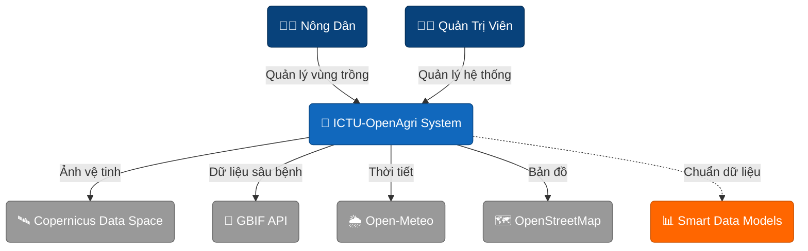
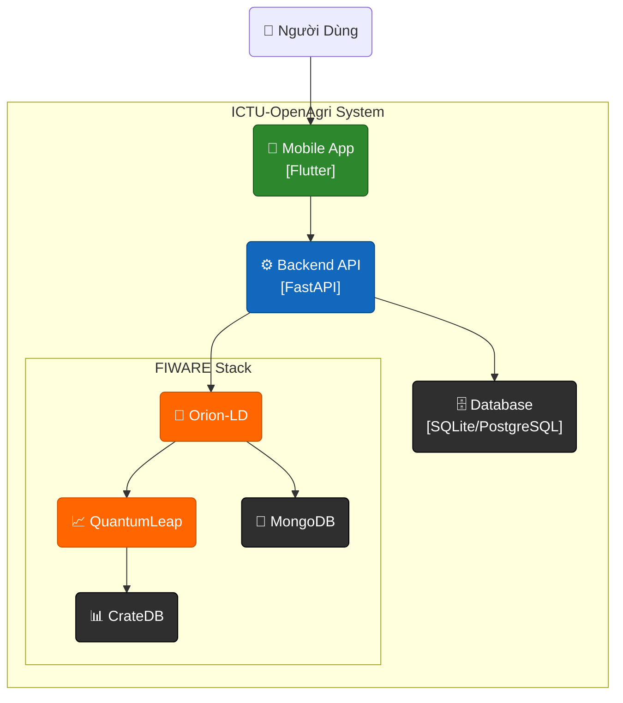

# Tổng Quan Kiến Trúc

Hệ thống ICTU-OpenAgri được thiết kế theo mô hình **C4 Model** kết hợp với **Clean Architecture** ở phía Backend.

---

## System Context (Level 1)

Mô tả sự tương tác giữa người dùng và các hệ thống bên ngoài.

---

## Container (Level 2)

Chi tiết các thành phần chính và công nghệ sử dụng.

---

## Component (Level 3)

Xem chi tiết tại: [Backend Architecture](backend.md)

---

## Công Nghệ Sử Dụng

### Backend

| Công nghệ   | Mục đích             |
| ----------- | -------------------- |
| FastAPI     | Web Framework        |
| SQLAlchemy  | ORM (AsyncIO)        |
| TensorFlow  | AI Disease Detection |
| Rasterio    | Xử lý ảnh vệ tinh    |
| APScheduler | Background Jobs      |

### Frontend

| Công nghệ   | Mục đích         |
| ----------- | ---------------- |
| Flutter     | UI Framework     |
| Provider    | State Management |
| Flutter Map | Bản đồ           |
| Dio         | HTTP Client      |

### FIWARE

| Công nghệ   | Mục đích               |
| ----------- | ---------------------- |
| Orion-LD    | NGSI-LD Context Broker |
| QuantumLeap | Time-series API        |
| CrateDB     | Time-series Database   |

---

## Bước Tiếp Theo

- [Backend Architecture](backend.md)
- [FIWARE Integration](fiware.md)
